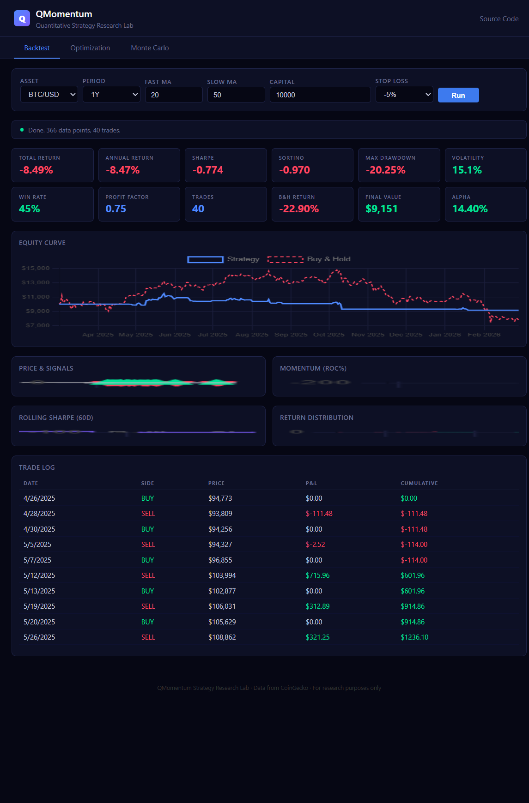
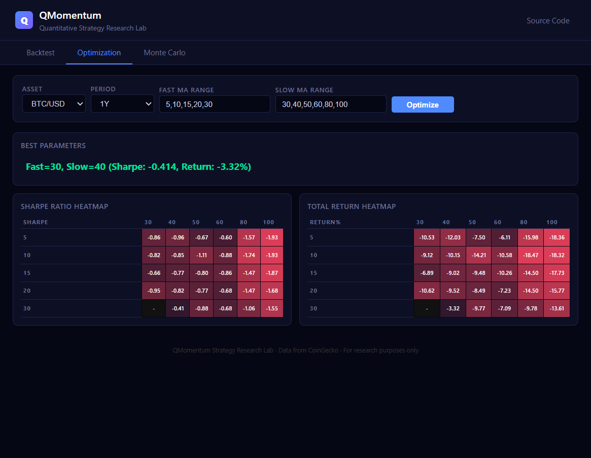
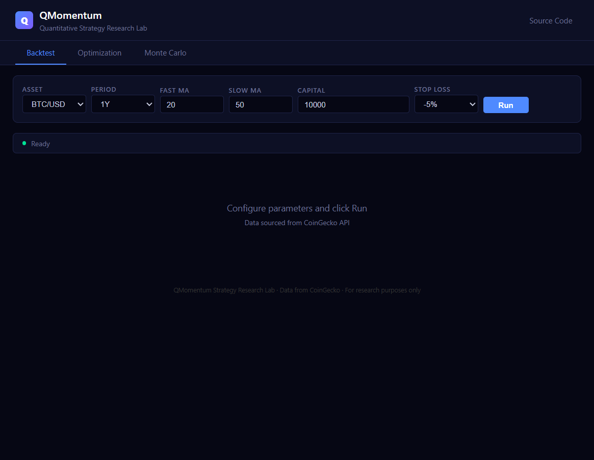

# QMomentum — Crypto Quantitative Strategy Research Lab

A full-featured quantitative backtesting platform for cryptocurrency momentum strategies. Built with Python for the backend engine and a pure JavaScript frontend deployed on GitHub Pages — no server required. Fetches real-time market data from CoinGecko, runs strategy simulations, and presents interactive results with professional-grade charts and analytics.

> **[Live Demo](https://sahimagupta.github.io/crypto-momentum-strategy/)** — Open and click "Run" to see it in action. No installation needed.

---

## Table of Contents

- [What This Project Does](#what-this-project-does)
- [Live Demo](#live-demo)
- [Screenshots](#screenshots)
- [How the Strategy Works](#how-the-strategy-works)
- [Architecture Overview](#architecture-overview)
- [The Data Pipeline](#the-data-pipeline)
- [Technical Indicators](#technical-indicators)
- [Signal Generation Logic](#signal-generation-logic)
- [Backtesting Engine](#backtesting-engine)
- [Risk Management](#risk-management)
- [Performance Metrics Explained](#performance-metrics-explained)
- [Parameter Optimization](#parameter-optimization)
- [Monte Carlo Simulation](#monte-carlo-simulation)
- [Web Dashboard Features](#web-dashboard-features)
- [Project Structure](#project-structure)
- [Running Locally (CLI)](#running-locally-cli)
- [API Choice: Why CoinGecko](#api-choice-why-coingecko)
- [Technology Stack](#technology-stack)
- [Limitations & Future Work](#limitations--future-work)

---

## What This Project Does

This project answers a simple question: **Can a momentum-based strategy outperform buy-and-hold in the crypto market?**

It builds a complete research pipeline:

1. **Fetches** historical daily price data for any major cryptocurrency
2. **Computes** technical indicators (moving averages, momentum, Bollinger Bands, volume profiles)
3. **Generates** buy/sell signals using a rule-based strategy with multiple confirmation filters
4. **Simulates** trading on historical data with realistic transaction costs and stop-loss
5. **Evaluates** performance using institutional-grade risk metrics (Sharpe, Sortino, Calmar, etc.)
6. **Optimizes** parameters via grid search with heatmap visualization
7. **Estimates risk** through Monte Carlo simulation (500+ random equity paths)

Everything runs in the browser via the GitHub Pages dashboard — or locally through the Python CLI.

---

## Live Demo

**https://sahimagupta.github.io/crypto-momentum-strategy/**

The web dashboard is a static HTML/JavaScript application hosted on GitHub Pages. It calls the CoinGecko API directly from the browser, runs all strategy calculations in JavaScript, and renders interactive charts using Chart.js. No backend server is needed.

---

## Screenshots

### Backtest Dashboard
The main backtesting interface. Select an asset, configure strategy parameters, and click "Run". Results include 12 key performance indicators, an equity curve comparison against buy-and-hold, price charts with entry/exit markers, momentum oscillator, rolling Sharpe ratio, and return distribution histogram.



### Parameter Optimization
Grid search across different Fast MA and Slow MA combinations. The heatmaps show Sharpe Ratio and Total Return for each parameter pair, making it easy to identify which combinations work best. The best parameters are highlighted at the top.



### Landing Page
Clean configuration interface with adjustable parameters: asset selection (BTC, ETH, SOL, ADA, XRP), lookback period, moving average windows, starting capital, and stop-loss threshold.



---

## How the Strategy Works

The strategy is a **dual moving average crossover with momentum confirmation and volume filter**. Here is exactly how it decides when to buy and sell:

### Entry Conditions (Buy Signal)

All three conditions must be true simultaneously:

1. **MA Crossover**: The fast Simple Moving Average (20-day) is above the slow Simple Moving Average (50-day). This indicates the short-term trend is bullish — recent prices are higher than the longer-term average.

2. **Momentum Confirmation**: The 14-day Rate of Change (ROC) is positive. ROC measures how much the price has changed over the last 14 days as a percentage. A positive ROC confirms the price is actually moving upward, not just hovering.

3. **Volume Confirmation**: Current trading volume is at least 80% of the 20-day volume moving average. This ensures the price movement has real market participation behind it, filtering out low-volume fake breakouts.

### Exit Conditions (Sell Signal)

Any one of these triggers an exit:

1. **MA Crossover reversal**: Fast MA drops below slow MA (trend is turning bearish)
2. **Momentum turns negative**: 14-day ROC drops below zero
3. **Stop-loss hit**: Position has lost more than 5% from entry price

### Look-Ahead Bias Prevention

Signals are shifted by one day. If the strategy generates a buy signal based on today's data, the trade executes at tomorrow's price. This prevents the unrealistic assumption that you could trade at the same price used to calculate the signal.

```
Day 50: Indicators say BUY → Signal recorded
Day 51: Trade executes at Day 51's closing price
```

---

## Architecture Overview

The project has two independent interfaces sharing the same strategy logic:

```
                  ┌─────────────────────────────┐
                  │      CoinGecko Free API      │
                  │  (Historical Price + Volume)  │
                  └──────────┬──────────────────┘
                             │
              ┌──────────────┼──────────────────┐
              │              │                   │
     ┌────────▼────────┐  ┌─▼──────────────────▼──┐
     │  Python CLI      │  │  Web Dashboard (JS)    │
     │  (main.py)       │  │  (docs/index.html)     │
     │                  │  │                        │
     │  data_loader.py  │  │  fetch() → CoinGecko   │
     │  strategy.py     │  │  simulate() in JS      │
     │  backtester.py   │  │  Chart.js rendering    │
     │  utils.py        │  │  GitHub Pages hosted   │
     └────────┬─────────┘  └──────────┬────────────┘
              │                       │
    ┌─────────▼──────────┐  ┌─────────▼──────────┐
    │  Terminal Output    │  │  Browser Dashboard  │
    │  + PNG Charts      │  │  (Interactive)       │
    │  + CSV Exports     │  │                      │
    └────────────────────┘  └──────────────────────┘
```

The Python backend (`main.py`) is the full-featured backtesting engine with matplotlib charts, CSV exports, and command-line argument parsing.

The web dashboard (`docs/index.html`) is a standalone single-page application that reimplements the strategy in JavaScript, fetches data directly from CoinGecko in the browser, and renders everything client-side with Chart.js.

---

## The Data Pipeline

### Data Source: CoinGecko API

The project fetches data from CoinGecko's free `/market_chart` endpoint:

```
GET https://api.coingecko.com/api/v3/coins/{coin_id}/market_chart
    ?vs_currency=usd
    &days=365
    &interval=daily
```

This returns three arrays:
- **prices**: Daily closing prices in USD (timestamp + value pairs)
- **total_volumes**: Daily trading volume in USD
- **market_caps**: Daily market capitalization

### Data Processing

1. **Timestamp conversion**: Millisecond Unix timestamps are converted to datetime objects
2. **Alignment**: Price, volume, and market cap series are joined on their timestamp index
3. **Cleaning**: Rows with missing close prices are dropped
4. **Validation**: The loader checks that at least 60 data points exist (minimum needed for the 50-day moving average to compute)

### Error Handling

The data loader includes:
- **Retry logic**: 3 attempts with exponential backoff on failure
- **Rate limit handling**: If CoinGecko returns HTTP 429, the loader waits 10/20/30 seconds before retrying
- **Timeout protection**: 30-second timeout per request
- **Validation**: Checks for minimum data points and missing columns

---

## Technical Indicators

### Simple Moving Average (SMA)

```
SMA(n) = (P1 + P2 + ... + Pn) / n
```

Two SMAs are computed:
- **Fast SMA (20-day)**: Reacts quickly to price changes. Represents short-term trend.
- **Slow SMA (50-day)**: Smooths out noise. Represents longer-term trend.

When the fast SMA crosses above the slow SMA, it suggests the short-term trend is turning bullish.

### Rate of Change (Momentum)

```
ROC(14) = ((Price_today - Price_14_days_ago) / Price_14_days_ago) × 100
```

Measures the percentage change in price over a lookback period. A positive ROC means price is higher than it was 14 days ago — there is upward momentum.

### Bollinger Bands

```
Middle Band = SMA(20)
Upper Band  = SMA(20) + 2 × StdDev(20)
Lower Band  = SMA(20) - 2 × StdDev(20)
Band Width  = (Upper - Lower) / Middle
```

Bollinger Bands measure volatility. When bands are wide, the market is volatile. When narrow, it is calm. The strategy uses band width as context — it does not directly generate signals from Bollinger Bands, but they help visualize market conditions.

### Volume Moving Average

```
Volume MA(20) = Average volume over last 20 days
Volume Ratio  = Today's Volume / Volume MA(20)
```

A volume ratio above 0.8 confirms that enough market participants are active. This filters out signals that occur during low-volume periods, which are more likely to be false breakouts.

---

## Signal Generation Logic

Here is the exact signal generation code, simplified:

```python
# Entry: all conditions must be true
buy_signal = (fast_sma > slow_sma) AND (momentum > 0) AND (volume_ratio > 0.8)

# The signal is shifted by 1 day to prevent look-ahead bias
position = signal.shift(1)

# Trades occur where position changes
trade = position.diff()  # +1 = buy, -1 = sell
```

The shift is critical. Without it, the strategy would be "cheating" — using information from the current bar to trade at the current bar's price. In real trading, you see the close price, compute your signal, and can only trade the next day.

---

## Backtesting Engine

The backtester simulates a simple portfolio:

### Execution Model

- **Position sizing**: 100% of capital (all-in on buy, full exit on sell)
- **Transaction cost**: 0.1% per trade (typical crypto exchange fee)
- **Slippage**: Not modeled (assumes execution at close price)
- **Short selling**: Not supported (long-only strategy)

### Trade Lifecycle

```
1. BUY signal detected
   → Deduct transaction fee from capital
   → Calculate units: (capital - fee) / price
   → Record entry price for stop-loss tracking

2. Position held
   → Monitor for stop-loss: if (current_price - entry_price) / entry_price <= -5%
   → Force exit on stop-loss trigger

3. SELL signal detected (or stop-loss)
   → Sell all holdings at current price
   → Deduct transaction fee from revenue
   → Calculate P&L for this trade
```

### Portfolio Tracking

Every day, the engine records:
- Portfolio value (cash + holdings × price)
- Cash balance
- Number of units held
- Whether currently in a position

This creates a daily equity curve that can be compared against the buy-and-hold benchmark.

---

## Risk Management

### Stop-Loss

A per-trade stop-loss is implemented. If the price drops more than 5% below the entry price, the position is automatically closed. This limits the maximum loss on any single trade.

```
stop_loss_trigger = (current_price - entry_price) / entry_price <= -0.05
```

The stop-loss is checked every day before evaluating new signals.

### Position Sizing

The current implementation uses all-in sizing (100% of capital per trade). This is simple but aggressive. In a production system, you would use fractional sizing (e.g., Kelly criterion or fixed-fraction).

---

## Performance Metrics Explained

The backtester calculates 12 performance metrics:

| Metric | Formula | What It Tells You |
|--------|---------|-------------------|
| **Total Return** | (Final Value / Initial Value) - 1 | Overall profit or loss |
| **Annual Return** | (1 + Total Return)^(365/days) - 1 | Return normalized to 1 year |
| **Sharpe Ratio** | √365 × (mean_excess_return / std_returns) | Risk-adjusted return. Above 1.0 is good, above 2.0 is excellent |
| **Sortino Ratio** | √365 × (mean_excess_return / downside_std) | Like Sharpe but only penalizes downside volatility |
| **Calmar Ratio** | Annual Return / abs(Max Drawdown) | Return per unit of worst-case drawdown |
| **Max Drawdown** | Largest peak-to-trough decline | Worst case scenario — how much you could lose from peak |
| **Max DD Duration** | Longest period in drawdown | How long until recovery from worst loss |
| **Volatility** | std(daily_returns) × √365 | Annualized price fluctuation |
| **Win Rate** | Profitable trades / Total trades | Percentage of trades that made money |
| **Profit Factor** | Gross Wins / Gross Losses | How much you win for every dollar you lose. Above 1.0 = profitable |
| **Alpha** | Strategy Return - Buy & Hold Return | Excess return over passive holding |
| **Total Trades** | Count of all buy + sell executions | Trading frequency |

---

## Parameter Optimization

The optimization module performs a **grid search** across all combinations of Fast MA and Slow MA periods.

### How It Works

1. Define ranges: Fast MA = [5, 10, 15, 20, 30], Slow MA = [30, 40, 50, 60, 80, 100]
2. For each valid combination (Fast < Slow), run the full backtest
3. Record the Sharpe Ratio and Total Return
4. Display results as color-coded heatmaps
5. Highlight the best-performing parameter combination

### Reading the Heatmap

- **Green cells**: Positive Sharpe / positive return — the strategy made money with this parameter combination
- **Red cells**: Negative Sharpe / negative return — the strategy lost money
- **Color intensity**: Darker = more extreme (better or worse)
- **Rows**: Fast MA period
- **Columns**: Slow MA period

This helps identify which parameter ranges are robust (consistently green) versus fragile (mixed colors).

---

## Monte Carlo Simulation

Monte Carlo simulation estimates the **range of possible outcomes** by randomly shuffling the strategy's historical daily returns.

### How It Works

1. Take the actual daily returns from the backtest
2. For each simulation (default: 500):
   - Randomly sample daily returns with replacement
   - Build a synthetic equity curve from these shuffled returns
   - Record the final portfolio value
3. Analyze the distribution of 500 final values

### What It Shows

- **Percentiles** (5th, 25th, 50th, 75th, 95th): Range of likely outcomes
- **P(Loss)**: Probability that the strategy ends with less than starting capital
- **Equity paths chart**: Visual fan of possible trajectories
- **Final value distribution**: Histogram showing where outcomes cluster

This answers questions like: "Even if the strategy's logic is sound, how much could randomness affect the outcome?"

---

## Web Dashboard Features

The dashboard has three tabs:

### 1. Backtest Tab
- Select from 5 cryptocurrencies (BTC, ETH, SOL, ADA, XRP)
- Adjustable parameters: lookback period, MA windows, capital, stop-loss
- 12 KPI cards with color-coded positive/negative values
- **Equity Curve**: Strategy portfolio value vs buy-and-hold benchmark
- **Price & Signals**: Price chart with SMA lines and buy/sell markers (green triangles = buy, red triangles = sell)
- **Momentum**: Bar chart showing 14-day Rate of Change
- **Rolling Sharpe**: 60-day rolling Sharpe ratio to see how performance changes over time
- **Return Distribution**: Histogram of daily returns showing the shape of the return profile
- **Trade Log**: Every trade with date, side, price, P&L, and running cumulative P&L

### 2. Optimization Tab
- Define Fast MA and Slow MA ranges as comma-separated values
- Runs all valid combinations automatically
- **Sharpe Ratio Heatmap**: Color-coded grid of risk-adjusted returns
- **Total Return Heatmap**: Color-coded grid of raw returns
- **Best Parameters**: Auto-detected optimal combination

### 3. Monte Carlo Tab
- Choose number of simulations (100, 500, or 1000)
- **Simulated Equity Paths**: Fan chart of random portfolio trajectories
- **Percentile KPIs**: 5th through 95th percentile final values
- **Loss Probability**: Percentage chance of ending below starting capital
- **Final Value Distribution**: Histogram of simulated outcomes

---

## Project Structure

```
crypto-momentum-strategy/
│
├── main.py                  # CLI entry point — argument parsing, orchestration
├── data_loader.py           # CoinGecko API client with retry logic
├── strategy.py              # Technical indicator computation & signal generation
├── backtester.py            # Portfolio simulation engine with stop-loss
├── utils.py                 # Metrics calculation, matplotlib charts, CSV export
├── config.py                # Default strategy parameters
├── app.py                   # Flask web server (optional, for local UI)
├── requirements.txt         # Python dependencies
│
├── docs/
│   ├── index.html           # GitHub Pages dashboard (standalone JS app)
│   └── screenshots/         # README images
│       ├── landing.png
│       ├── backtest.png
│       └── optimization.png
│
├── templates/
│   └── index.html           # Flask template (local server UI)
│
└── output/                  # Generated results (after running CLI)
    └── bitcoin/
        ├── equity_curve.png
        ├── signals.png
        ├── daily_portfolio.csv
        └── trade_log.csv
```

### File Responsibilities

| File | Lines | Purpose |
|------|-------|---------|
| `main.py` | ~100 | Parses CLI arguments, orchestrates the pipeline, handles errors |
| `data_loader.py` | ~90 | Fetches price data from CoinGecko with retry/rate-limit handling |
| `strategy.py` | ~90 | Computes SMA, ROC, Bollinger Bands, volume MA; generates signals |
| `backtester.py` | ~130 | Simulates trades with fees, stop-loss, and portfolio tracking |
| `utils.py` | ~180 | Calculates 12+ metrics, generates matplotlib charts, exports CSV |
| `config.py` | ~20 | Central configuration for all default parameters |
| `docs/index.html` | ~450 | Complete web dashboard — data fetch, strategy, charts, all in one file |

---

## Running Locally (CLI)

### Prerequisites

- Python 3.8 or higher
- Internet connection (for CoinGecko API)

### Installation

```bash
git clone https://github.com/sahimagupta/crypto-momentum-strategy.git
cd crypto-momentum-strategy
pip install -r requirements.txt
```

### Basic Usage

```bash
# Default: Bitcoin, 1 year, 20/50 MA
python main.py

# Test on Ethereum with 2 years of data
python main.py --coin ethereum --days 730

# Custom moving average periods
python main.py --short-ma 10 --long-ma 30

# Compare strategy across 5 coins
python main.py --compare

# Disable stop-loss
python main.py --no-stop-loss

# Different starting capital
python main.py --capital 50000
```

### CLI Output

The CLI prints a performance summary to the terminal and saves charts + CSV files to the `output/` folder:

```
==================================================
  BACKTESTING: BITCOIN
  Period: 365 days | MA: 20/50
  Capital: $10,000 | Stop-loss: -0.05
==================================================

[*] Fetching 365 days of BITCOIN data...
[+] Loaded 366 data points: 2025-03-01 to 2026-02-28
[+] Signals: 20 buys, 20 sells
[+] In market: 78/364 days (21.4%)
[+] Backtest done: 40 trades, fees=$412.49, net P&L=$-642.82

==================================================
         STRATEGY PERFORMANCE SUMMARY
==================================================
  Total Return                         -8.49%
  Annual Return                        -8.54%
  Sharpe Ratio                         -0.773
  Sortino Ratio                        -1.002
  Calmar Ratio                         -0.422
  Max Drawdown                        -20.25%
  Max DD Duration                    282 days
  Annual Volatility                    15.21%
  Win Rate                              45.0%
  Avg Win                             $218.28
  Avg Loss                           $-237.03
  Profit Factor                          0.75
  Total Trades                             40
  Buy & Hold Return                   -30.29%
  Final Portfolio                   $9,150.60
==================================================
```

---

## API Choice: Why CoinGecko

I chose CoinGecko's free API for several reasons:

1. **No API key required**: The `/market_chart` endpoint works without authentication, making it easy for anyone to clone and run the project immediately.

2. **Reliable daily data**: Returns clean OHLCV data aggregated to daily intervals, which is exactly what a daily-timeframe strategy needs.

3. **Wide asset coverage**: Supports thousands of cryptocurrencies. The project uses 5 (BTC, ETH, SOL, ADA, XRP) but can easily extend to any coin CoinGecko tracks.

4. **Browser-compatible**: The API supports CORS, which means the web dashboard can call it directly from JavaScript without needing a proxy server. This is why the entire dashboard can run on GitHub Pages.

5. **Free tier limits**: The free tier allows ~10-30 calls per minute, which is sufficient for this use case. The Python backend includes retry logic with exponential backoff to handle rate limits gracefully.

### Alternative APIs Considered

| API | Why Not Used |
|-----|--------------|
| Binance API | Requires API key for historical data; more complex authentication |
| Yahoo Finance | Crypto data is limited and sometimes delayed |
| Alpha Vantage | Requires API key; rate limits are stricter on free tier |
| CryptoCompare | Good alternative but CoinGecko had simpler endpoint structure |

---

## Technology Stack

### Backend (Python CLI)

| Technology | Purpose |
|-----------|---------|
| **Python 3.8+** | Core language |
| **pandas** | DataFrame operations, time series handling, rolling calculations |
| **numpy** | Numerical operations (Sharpe ratio, standard deviation, etc.) |
| **matplotlib** | Static chart generation (equity curves, signal plots) |
| **requests** | HTTP client for CoinGecko API calls |
| **Flask** | Optional local web server for the browser UI |

### Frontend (Web Dashboard)

| Technology | Purpose |
|-----------|---------|
| **Vanilla JavaScript** | All strategy logic, no frameworks |
| **Chart.js 4.4** | Interactive chart rendering (line, bar, scatter) |
| **chartjs-adapter-date-fns** | Time-axis formatting for Chart.js |
| **HTML5 + CSS3** | UI layout and dark theme styling |
| **GitHub Pages** | Free static hosting |

### Why No React/Vue/Angular?

The dashboard is a single HTML file (~450 lines) that does everything client-side. A framework would add unnecessary complexity and build steps for what is essentially a data visualization page. Keeping it as vanilla JS means:
- Zero build process
- Instant deployment via GitHub Pages
- Easy to read and understand the strategy logic
- No node_modules, no webpack, no dependencies to manage

---

## Limitations & Future Work

### Current Limitations

- **Daily timeframe only**: The strategy operates on daily candles. Intraday strategies would need different data sources and higher-frequency data.
- **No slippage modeling**: Trades execute at the closing price. In reality, there would be some slippage between the signal and execution.
- **100% position sizing**: The strategy goes all-in on each trade. Real strategies use fractional sizing.
- **Single-asset focus**: Each backtest runs on one asset. No portfolio-level analysis across multiple assets simultaneously.
- **No shorting**: Long-only strategy. In bearish markets, the strategy can only avoid losses by being in cash.

### Possible Improvements

- [ ] Add intraday data support (4h, 1h candles)
- [ ] Implement Kelly Criterion for position sizing
- [ ] Add multi-asset portfolio optimization (Markowitz)
- [ ] Implement walk-forward analysis (out-of-sample testing)
- [ ] Add more strategy types (mean reversion, breakout)
- [ ] Export results as PDF report
- [ ] Add Telegram alerts for live signals

---

## License

This project is for educational and research purposes. It is not financial advice. Past performance does not guarantee future results. Use at your own risk.
