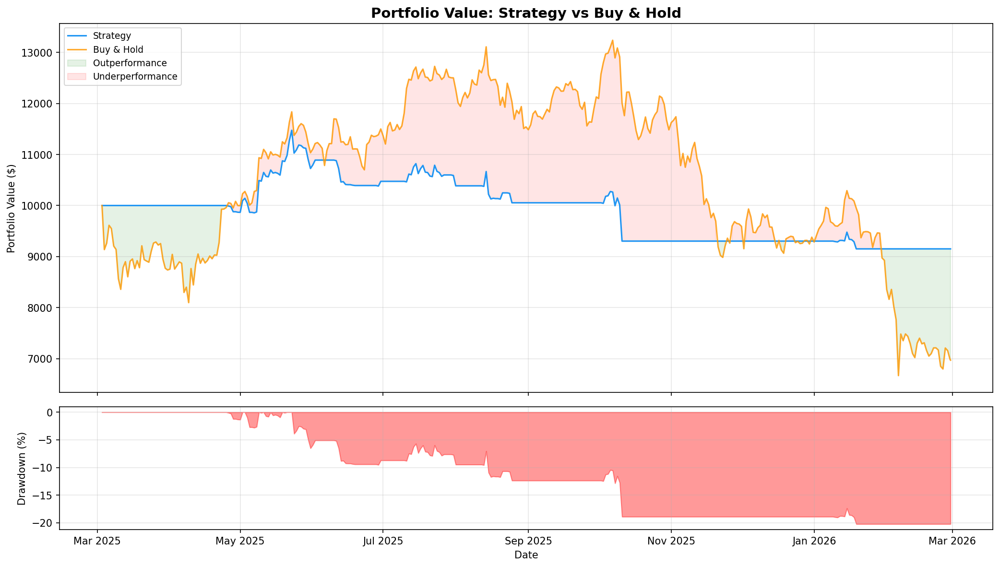
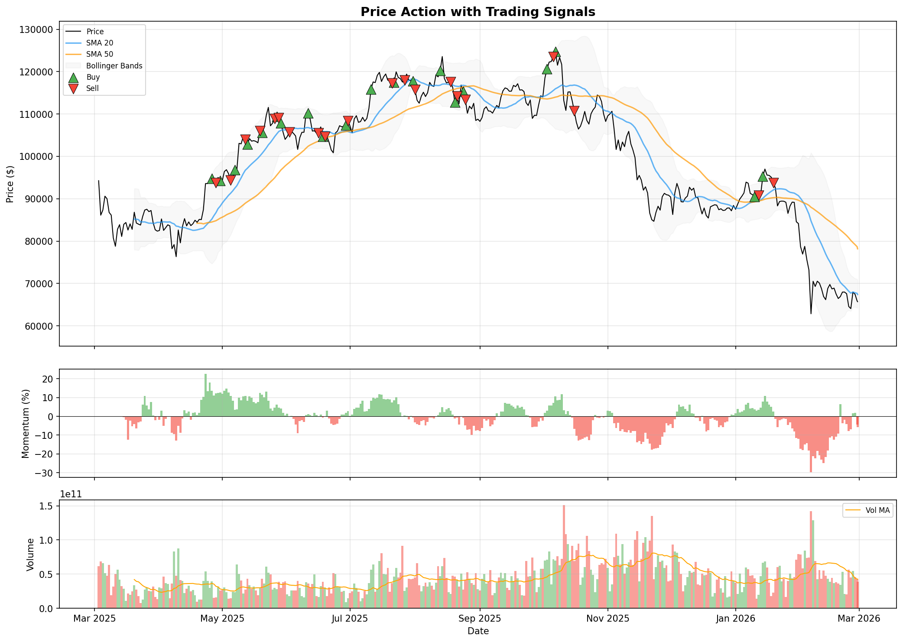

# Crypto Momentum Strategy Backtester

Backtests a momentum-based moving average crossover strategy on cryptocurrency price data. Uses CoinGecko's free API for historical data and simulates trading with realistic transaction costs and stop-loss.

## Strategy

The strategy combines two signals to decide when to enter and exit positions:

**Entry (Buy):**
- Short-term SMA (20-day) crosses above Long-term SMA (50-day)
- Momentum (14-day Rate of Change) is positive
- Volume is above its 20-day average

**Exit (Sell):**
- Short-term SMA crosses below Long-term SMA
- OR Momentum turns negative
- OR Stop-loss triggered (-5%)

Signals are shifted by one day to prevent look-ahead bias.

## Quick Start

`ash
# install dependencies
pip install -r requirements.txt

# run with defaults (BTC, 1 year)
python main.py

# test on ethereum
python main.py --coin ethereum

# custom parameters
python main.py --coin bitcoin --days 730 --short-ma 10 --long-ma 30

# compare across multiple coins
python main.py --compare

# disable stop-loss
python main.py --no-stop-loss
`

## Command Line Options

| Flag | Description | Default |
|------|-------------|---------|
| `--coin` | Coin to backtest | bitcoin |
| `--days` | Historical data period | 365 |
| `--short-ma` | Short MA window | 20 |
| `--long-ma` | Long MA window | 50 |
| `--capital` | Starting capital (USD) | 10000 |
| `--no-stop-loss` | Disable stop-loss | False |
| `--compare` | Run on multiple coins | False |

## Output

The backtester generates:

- **Performance metrics** printed to console (Sharpe, Sortino, Calmar ratios, drawdown, win rate, etc.)
- `output/<coin>/equity_curve.png` - portfolio value vs buy-and-hold
- `output/<coin>/signals.png` - price chart with entry/exit markers and indicators
- `output/<coin>/daily_portfolio.csv` - daily portfolio values
- `output/<coin>/trade_log.csv` - all executed trades with P&L


## Sample Output

### Performance Metrics
```
==================================================
         STRATEGY PERFORMANCE SUMMARY
==================================================
  Total Return                         -8.49%
  Annual Return                        -8.54%
  Sharpe Ratio                         -0.773
  Sortino Ratio                        -1.002
  Calmar Ratio                         -0.422
  Max Drawdown                        -20.25%
  Max DD Duration                    282 days
  Annual Volatility                    15.21%
  Win Rate                              45.0%
  Avg Win                             $218.28
  Avg Loss                           $-237.03
  Profit Factor                          0.75
  Total Trades                             40
  Buy & Hold Return                   -30.29%
  Final Portfolio                   $9,150.60
==================================================
```

### Equity Curve


### Trading Signals


## Project Structure

`
crypto-momentum-strategy/
|-- main.py              # CLI entry point with argument parsing
|-- data_loader.py       # CoinGecko API data fetching with retries
|-- strategy.py          # Technical indicators and signal generation
|-- backtester.py        # Portfolio simulation with stop-loss
|-- utils.py             # Metrics, plotting, and CSV export
|-- config.py            # Default parameters
|-- requirements.txt     # Python dependencies
`

## Metrics Reported

| Metric | Description |
|--------|-------------|
| Total Return | Overall portfolio return |
| Sharpe Ratio | Risk-adjusted return (annualized) |
| Sortino Ratio | Downside risk-adjusted return |
| Calmar Ratio | Return / Max Drawdown |
| Max Drawdown | Largest peak-to-trough decline |
| Win Rate | Percentage of profitable trades |
| Profit Factor | Gross profit / Gross loss |

## Technical Details

- **Data source**: CoinGecko free API (no key required)
- **Indicators**: SMA, Rate of Change, Bollinger Bands, Volume MA
- **Transaction costs**: 0.1% per trade (configurable)
- **Look-ahead bias**: Prevented via 1-day signal shift
- **Stop-loss**: Configurable per-trade stop-loss (default -5%)
- **Benchmark**: Buy-and-hold strategy on same asset

## Requirements

- Python 3.8+
- pandas, numpy, matplotlib, requests
